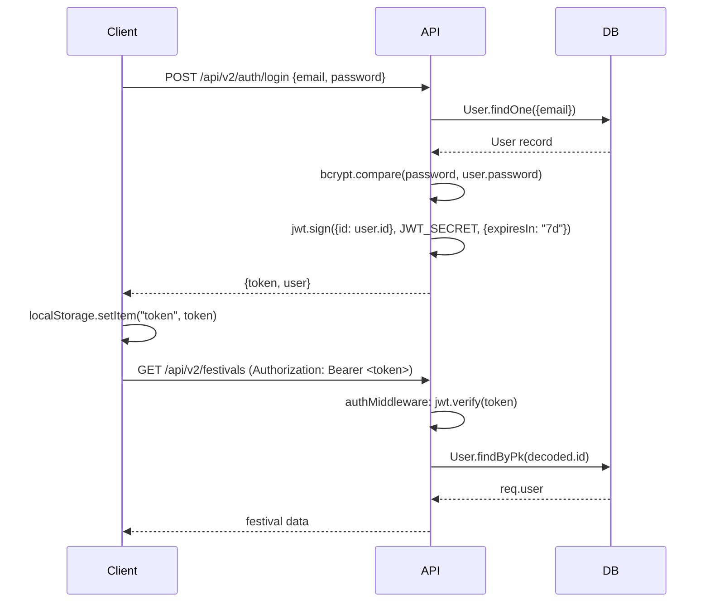
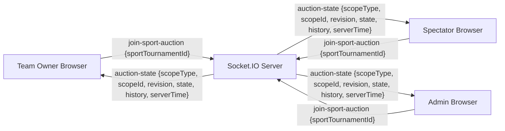
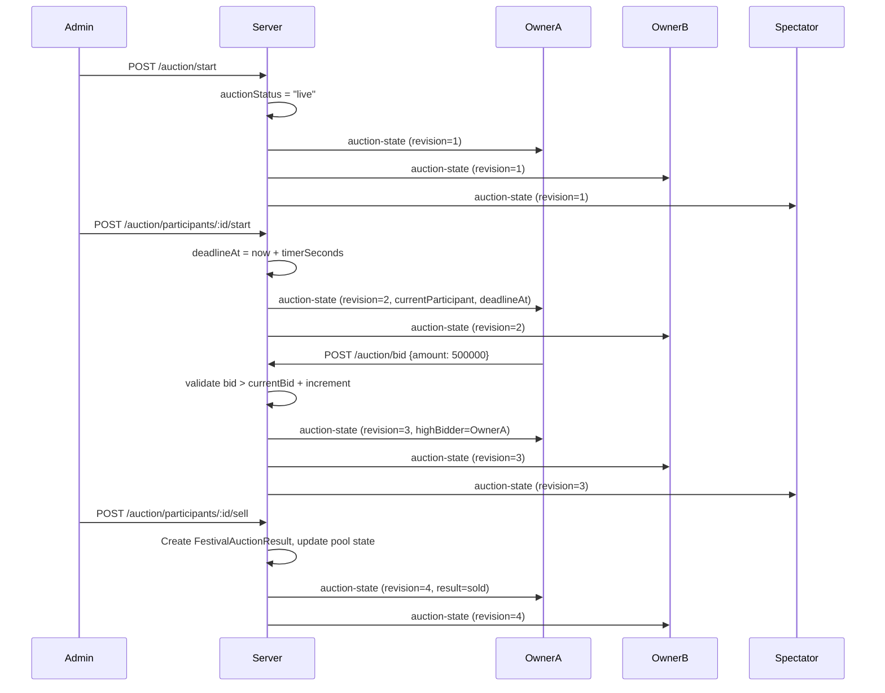
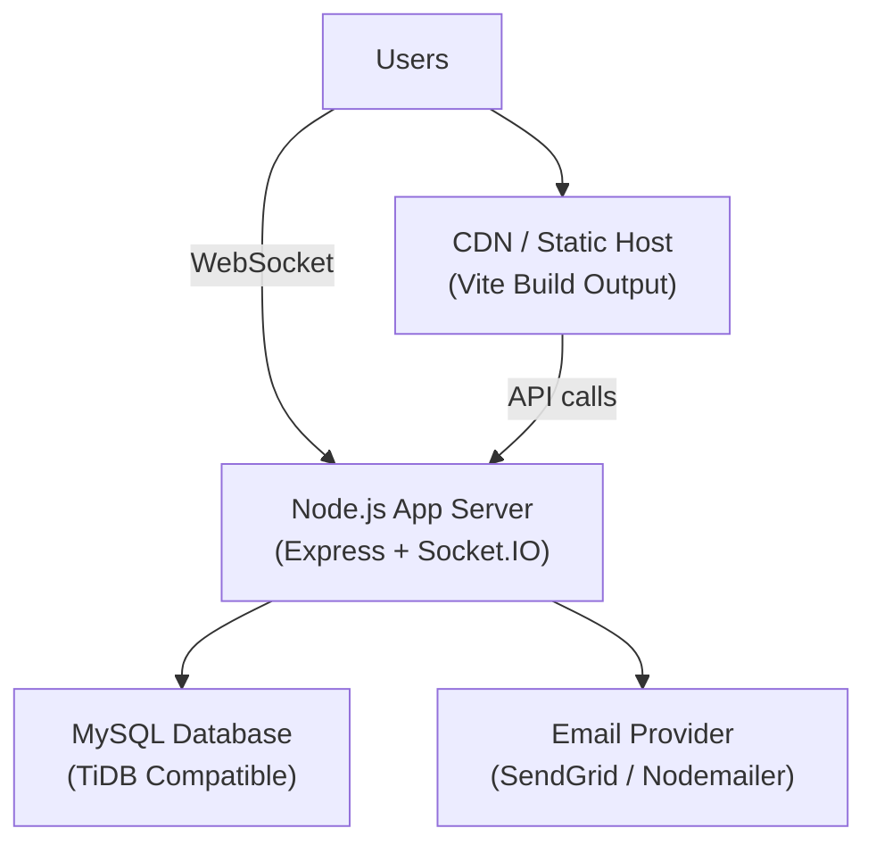

# Auction Tracker — Technical Architecture Blueprint


## 1. Architecture Overview

Auction Tracker follows a **client-server, single-page application** architecture with a persistent WebSocket layer for real-time auction state propagation. The system is split into two independent, deployable services:

- **Frontend** — React 19 SPA served by Vite 6 dev server (or static CDN in production)
- **Backend** — Node.js ES Module REST + Socket.IO API server

Both services communicate over HTTP (REST) and WebSocket (Socket.IO). The backend persists all state to a **MySQL** (or TiDB-compatible) relational database via the Sequelize 6 ORM.

---

## 2. System Context Diagram
    Browser["Browser (React 19 SPA)"]
    API["Node.js / Express 4 API Server"]
    DB[(MySQL / TiDB)]
    Email["Email Service\n(Nodemailer / SendGrid / Resend)"]

    Browser -- "HTTPS REST /api/v1, /api/v2" --> API
    Browser -- "WebSocket (Socket.IO)" --> API
    API -- "Sequelize ORM" --> DB
    API -- "SMTP / SendGrid API" --> Email
---

## 3. Frontend Architecture

### Technology Stack

| Dependency | Version | Role |
|---|---|---|
| React | 19.0.0 | UI rendering, component model |
| React DOM | 19.0.0 | DOM binding |
| React Router DOM | 7.4.0 | Client-side routing |
| Material UI (MUI) | 6.4.8 | Component library, theming |
| MUI Icons Material | 6.4.8 | Icon set |
| Emotion React / Styled | 11.14.0 | CSS-in-JS for MUI |
| Axios | 1.8.4 | HTTP client |
| socket.io-client | 4.8.1 | WebSocket client |
| Vite | 6.2.0 | Build tool and dev server |
| ESLint | 9.21.0 | Code quality |

### Directory Structure

```
ipl-auction-tracker/src/
├── App.jsx                      # Root router definition
├── main.jsx                     # Application entry point
├── theme.js                     # MUI theme configuration
├── context/
│   ├── AuthContext.jsx           # Authentication context provider
│   └── auth-context.js          # Context factory
├── webSocket/
│   └── socket.js                # Socket.IO client singleton
├── pages/
│   ├── Login.jsx
│   ├── Register.jsx
│   ├── VerifyEmail.jsx
│   ├── ForgotPassword.jsx / ResetPassword.jsx / ChangePassword.jsx
│   ├── Dashboard.jsx
│   ├── ProfilePage.jsx / AccountSettingsPage.jsx
│   ├── EmployeeDirectory.jsx
│   ├── AuctionDirectory.jsx
│   ├── FestivalDashboard.jsx
│   ├── FestivalDetail.jsx
│   ├── FestivalCommandCenter.jsx
│   ├── FestivalAuctionHub.jsx
│   ├── FestivalLiveAuctionPage.jsx
│   ├── FestivalAuctionResultsPage.jsx
│   ├── SportTournamentDirectory.jsx
│   ├── SportTournamentWorkspace.jsx
│   ├── SportTournamentCommandCenter.jsx
│   ├── SportAuctionHub.jsx
│   ├── SportAuctionArena.jsx
│   ├── SportAuctionResultsPage.jsx
│   ├── AuctionPage.jsx          # Legacy team-owner auction page
│   ├── LiveAuctionPage.jsx      # Legacy admin auction page
│   └── SpectatorAuctionPage.jsx # Legacy spectator page
├── components/
│   ├── AppShell.jsx             # Layout wrapper (nav + content)
│   ├── RouteGuards.jsx          # GuestRoute, ProtectedRoute, DefaultRoute
│   ├── AdminDashboard.jsx
│   ├── AdminDashboardLayout/
│   ├── TeamOwnerDashboard/
│   ├── SpectatorDashboard/
│   ├── ProductDashboard/
│   ├── FestivalAuctionArena/
│   │   ├── ArenaHeader.jsx
│   │   ├── ParticipantStage.jsx
│   │   ├── TeamPanels.jsx
│   │   ├── LiveBidStream.jsx
│   │   ├── RecentResultsStrip.jsx
│   │   └── QueueSummary.jsx
│   ├── SportAuctionArena/
│   │   ├── SportArenaHeader.jsx
│   │   ├── SportParticipantStage.jsx
│   │   ├── SportTeamPanels.jsx
│   │   ├── SportLiveBidStream.jsx
│   │   ├── SportRecentResultsStrip.jsx
│   │   ├── SportQueueSummary.jsx
│   │   └── SportRoleControls.jsx
│   └── [Festival management components]
├── hooks/
│   └── useFestivalCommandCenterData.js
└── utils/
    ├── api.js                   # Axios instance with base URL
    ├── auctionSynchronization.js # shouldApplyAuctionSnapshot, mergeAuctionSnapshotState
    ├── auctionStages.js         # Stage derivation helpers
    ├── auctionHub.js            # Currency formatting
    ├── auctionIncrementEngine.js # (mirrors backend)
    ├── bidUtils.js
    ├── festivalWorkspace.js
    └── auctionStages.js
```

### Routing Model

All routes are defined in `App.jsx`. Protected routes use the `ProtectedRoute` component with an optional `allowedRoles` array. Public routes (login, register) use `GuestRoute`. A `DefaultRoute` handles 404 and authentication-state-based redirects.

Key route groups:
- `/festivals/*` — Admin-only festival management
- `/auctions/festivals/:festivalId` — Festival live auction (admin + team_owner + spectator)
- `/sport-tournaments/*` — Sport tournament management and auctions
- `/auctions/sports/:sportTournamentId` — Sport live auction arena

### Code Splitting

`FestivalLiveAuctionPage.jsx` uses `React.lazy` + `Suspense` to code-split the heavy `MainFestivalAuction` component, reducing initial bundle size.

---

## 4. Backend Architecture

### Technology Stack

| Dependency | Version | Role |
|---|---|---|
| Node.js | ES Modules | Runtime |
| Express | 4.21.2 | HTTP server and middleware |
| Socket.IO | 4.8.1 | WebSocket server |
| Sequelize | 6.37.6 | ORM |
| MySQL2 | 3.14.0 | Database driver |
| jsonwebtoken | 9.0.2 | JWT creation and verification |
| bcryptjs | 3.0.2 | Password hashing |
| zod | 3.25.76 | Request validation schemas |
| nodemailer | 8.0.11 | SMTP email |
| @sendgrid/mail | 8.1.6 | SendGrid email provider |
| resend | 6.12.4 | Resend email provider |
| dotenv | 16.4.7 | Environment configuration |
| cors | 2.8.5 | CORS headers |
| nodemon | 3.1.9 | Dev auto-restart |

### Directory Structure

```
ipl-auction-tracker-backend/src/
├── index.js                     # App entry: Express + Socket.IO bootstrap
├── config/
│   └── dbconfig.js              # Sequelize connection instance
├── models/                      # Sequelize model definitions
├── controllers/                 # Route handlers
├── routes/                      # Express router definitions
├── middleware/
│   ├── auth.middleware.js       # authMiddleware, adminMiddleware, teamOwnerMiddleware
│   ├── validate.middleware.js   # Zod schema validation
│   └── multipartCsv.middleware.js # Multer CSV file handling
├── validation/                  # Zod schemas (one file per domain)
├── utils/                       # Domain utility functions
└── database/
    └── migrator.js              # Custom migration runner
```

### Middleware Chain

```
Request
  → CORS middleware
  → Express JSON body parser
  → Router matching
    → authMiddleware (JWT verification, req.user population)
    → adminMiddleware / teamOwnerMiddleware (role gating)
    → validate(schema) (Zod validation)
    → Controller function
  → Response
```

### API Versioning

Routes are mounted at two prefixes:
- `/api/v1/*` — Legacy auction/team/player/tournament routes
- `/api/v2/*` — Festival, Employee, Sport Tournament, Auth routes

---

## 5. Database Architecture

The database is a relational MySQL (or TiDB-compatible) store accessed exclusively through Sequelize 6. Schema migrations are applied via a custom `migrator.js` that tracks applied migrations in a `SequelizeMeta` table.

### Sequelize Models — Complete List

**Core / Authentication:**
- `User` — id, name, email, password (bcrypt), role (ENUM: admin/team_owner/spectator), isVerified, verificationToken, resetPasswordToken, mustChangePassword
- `Employee` — id, employeeNumber, name, email, department, gender, employmentStatus, identityStatus, userId (FK nullable)
- `EmployeeUserLinkAudit` — audit trail for employee-user linking events

**Legacy Auction System:**
- `Auction` — legacy auction records
- `Bid` — legacy bid records
- `Team` — legacy team records
- `Player` — legacy player records
- `Sport` — sport catalogue (id, name, code, isActive)
- `Tournament` — legacy tournament records
- `TournamentTeam` — legacy tournament-team junction

**Festival System:**
- `Festival` — id, name, code, startDate, endDate, status (7-value ENUM), rosterFormationMode, teamAssignmentStatus, configurationLockState, timezone, currencyCode, createdByUserId
- `FestivalSport` — festival × sport junction with configJson
- `FestivalParticipant` — festival × employee participation record, status (registered/withdrawn)
- `FestivalParticipantSport` — participant × sport registration
- `FestivalTeam` — teams competing in a festival
- `FestivalTeamMembership` — participant-to-team assignment; rosterSource (auction/retention/admin_override/auto_balance/captain_assignment)
- `FestivalTeamOwner` — team owner assignment; userProvisioningStatus, credentialsSentAt
- `FestivalRetention` — pre-auction direct participant-to-team assignments
- `FestivalAuctionConfig` — per-festival auction parameters (totalBudget, ownerCost, incrementPercentage, auctionStatus, currentParticipantId)
- `FestivalAuction` — individual auction round record per participant
- `FestivalAuctionBid` — each bid placed during festival auction
- `FestivalAuctionPool` — pool of participants available for auction (state: available/auctioning/sold/unsold)
- `FestivalAuctionResult` — outcome per participant (outcome: sold/unsold)
- `FestivalOperationAudit` — audit log of all admin actions on a festival

**Sport Tournament System:**
- `SportTournament` — id, festivalId, festivalTeamId, festivalSportId, sportId, name, code, division (ENUM: men/women/mixed/open), participantGenderRule (ENUM: male/female/any), status (10-value ENUM), teamCount
- `SportTeam` — teams within a sport tournament (auto-generated, e.g. "Cricket Team A")
- `SportTeamMembership` — participant-to-sport-team assignment; source (captain_assignment/auction/...)
- `SportTeamCaptain` — captain assignment per sport team; links to FestivalParticipant
- `SportTeamBudget` — credit budget per sport team
- `SportAuctionPool` — participants eligible for the sport auction
- `SportAuctionConfig` — per-tournament auction parameters (incrementPercentage, auctionStatus, currentParticipantId)
- `SportAuction` — individual sport auction round record
- `SportAuctionBid` — each bid in a sport auction
- `SportAuctionResult` — outcome per participant in sport auction
- `SportOperationAudit` — audit trail for sport tournament admin actions

---

## 6. Authentication Flow



Token expiry is 7 days (`ACCESS_TOKEN_EXPIRES_IN = "7d"`). If `user.mustChangePassword` is `true`, all routes except `POST /api/v2/auth/change-password` return 403 with code `PASSWORD_CHANGE_REQUIRED`.

---

## 7. Authorization Model

### HTTP Route Level

```
All routes → authMiddleware (401 if no/invalid token)
Admin routes → adminMiddleware (403 if role !== "admin")
Team owner routes → teamOwnerMiddleware (403 if role !== "team_owner")
```

### Domain / Controller Level

```javascript
// Sport tournament: only admin or festival team owner can mutate
const canManage = await canManageFestivalTeamSports({
  user: req.user,
  festivalId,
  festivalTeamId,
});

// Sport auction: captain check for bidding permission
const captain = await findActiveSportCaptainForUser({
  userId: req.user.id,
  sportTournamentId,
});
// canBid = Boolean(captain)
```

### Frontend Route Level

```jsx
<ProtectedRoute allowedRoles={["admin"]}>
  <FestivalCommandCenter />
</ProtectedRoute>

<ProtectedRoute allowedRoles={["admin", "team_owner", "spectator"]}>
  <SportAuctionArena />
</ProtectedRoute>
```

---

## 8. Socket.IO Architecture



### Socket Rooms
- `join-auction` / `leave-auction` — Festival auction rooms, keyed by `festivalId`
- `join-sport-auction` / `leave-sport-auction` — Sport auction rooms, keyed by `sportTournamentId`

### Socket Event Payload (auction-state)
```json
{
  "scopeType": "sport",
  "scopeId": "<sportTournamentId>",
  "revision": 42,
  "serverTime": "2026-06-19T10:30:00.000Z",
  "state": { ... },
  "history": [ ... ]
}
```

---

## 9. Real-Time Auction Flow



---

## 10. API Layer — Route Summary

### Auth Routes (`/api/v2/auth`)
- `POST /register` — Public registration
- `POST /login` — Login, returns JWT
- `GET /verify-email/:token` — Email verification
- `POST /forgot-password` — Send reset email
- `POST /reset-password/:token` — Reset password
- `POST /change-password` — Change password (authenticated)

### Festival Routes (`/api/v2/festivals`)
- `POST /` — Create festival (admin)
- `GET /` — List all festivals
- `GET /:festivalId` — Get festival by ID
- `PATCH /:festivalId` — Update festival (admin)
- `POST /:festivalId/configuration/unlock` — Unlock configuration (admin)
- `POST /:festivalId/configuration/relock` — Relock configuration (admin)
- `PATCH /:festivalId/roster-formation-mode` — Set auction/manual mode (admin)
- `POST /:festivalId/sports` — Add sport to festival (admin)
- `POST /:festivalId/sports/bulk` — Bulk add sports (admin)
- `GET /:festivalId/sports` — List festival sports
- `POST /:festivalId/participants` — Add participant (admin)
- `GET /:festivalId/participants` — List participants (admin)
- `POST /:festivalId/participants/bulk` — Bulk add participants (admin)
- `POST /:festivalId/participants/add-all` — Add all active employees (admin)
- `POST /:festivalId/participants/bulk-remove` — Bulk remove participants (admin)
- `POST /:festivalId/participants/import` — CSV import (admin)
- `POST /:festivalId/teams` — Create team (admin)
- `GET /:festivalId/teams` — List teams
- `PATCH /:festivalId/teams/:teamId` — Update team (admin)
- `DELETE /:festivalId/teams/:teamId` — Delete team (admin)
- `POST /:festivalId/teams/:teamId/owner` — Assign team owner (admin)
- `GET /:festivalId/teams/:teamId/owner` — Get team owner (admin)
- `POST /:festivalId/teams/:teamId/owner/credentials` — Resend credentials (admin)
- `POST /:festivalId/retentions` — Create retention (admin)
- `DELETE /:festivalId/retentions/:id` — Delete retention (admin)
- `GET /:festivalId/auction-pool` — Get auction pool
- `PATCH /:festivalId/auction-config` — Configure auction (admin)
- `POST /:festivalId/auction/start` — Start auction (admin)
- `POST /:festivalId/auction/pause` — Pause (admin)
- `POST /:festivalId/auction/resume` — Resume (admin)
- `POST /:festivalId/auction/extend` — Extend timer (admin)
- `POST /:festivalId/auction/complete` — Complete auction (admin)
- `POST /:festivalId/auction/participants/:id/start` — Start participant round (admin)
- `POST /:festivalId/auction/participants/:id/sell` — Sell (admin)
- `POST /:festivalId/auction/participants/:id/unsold` — Mark unsold (admin)
- `POST /:festivalId/auction/reauction` — Re-auction unsold (admin)
- `POST /:festivalId/auction/bid` — Place bid (team_owner)
- `GET /:festivalId/auction/readiness` — Readiness check (admin)
- `GET /:festivalId/auction/current` — Current auction state
- `GET /:festivalId/auction/history` — Bid/result history
- `POST /:festivalId/team-assignments` — Manual assign participant (admin)
- `POST /:festivalId/team-assignments/auto-balance` — Auto balance (admin)
- `PATCH /:festivalId/team-assignments/lock` — Lock assignments (admin)

### Sport Tournament Routes (`/api/v2`)
- `GET /sport-tournaments` — List tournaments
- `GET /sport-tournaments/owner-contexts` — Owner's festival teams + sports
- `POST /festivals/:festivalId/teams/:teamId/sport-tournaments` — Create tournament
- `GET /sport-tournaments/:id` — Get tournament + permissions
- `PATCH /sport-tournaments/:id` — Update tournament
- `GET /sport-tournaments/:id/teams` — List sport teams
- `PATCH /sport-tournaments/:id/teams/:teamId` — Update sport team
- `POST /sport-tournaments/:id/teams/:teamId/captain` — Assign captain
- `DELETE /sport-tournaments/:id/teams/:teamId/captain` — Remove captain
- `GET /sport-tournaments/:id/eligibility` — Eligible participants
- `GET /sport-tournaments/:id/readiness` — Readiness check
- `GET /sport-tournaments/:id/budgets` — Team budgets
- `POST /sport-tournaments/:id/budgets/equal-distribution` — Equal distribution
- `PUT /sport-tournaments/:id/budgets` — Manual budgets
- `GET /sport-tournaments/:id/pool` — Auction pool
- `POST /sport-tournaments/:id/pool/generate` — Generate pool
- `PATCH /sport-tournaments/:id/auction/config` — Update auction config
- `POST /sport-tournaments/:id/auction/start|pause|resume|extend|complete` — Lifecycle
- `POST /sport-tournaments/:id/auction/participants/:id/start|sell|unsold` — Round control
- `POST /sport-tournaments/:id/auction/reauction` — Re-auction
- `POST /sport-tournaments/:id/auction/bid` — Place bid
- `GET /sport-tournaments/:id/auction/current` — Current state
- `GET /sport-tournaments/:id/auction/history` — History

### Employee Routes (`/api/v2/employees`)
- CRUD for employee records; CSV import

### Auth Legacy Routes (`/api/v1`)
- Legacy team, player, tournament, auction, bid endpoints

---

## 11. Data Model (Entity Relationship Summary)

```
User (1) ──< Festival (*)
User (1) ──< FestivalTeamOwner (*)
Employee (1) ──< FestivalParticipant (*)
Festival (1) ──< FestivalSport (*)
Festival (1) ──< FestivalParticipant (*)
Festival (1) ──< FestivalTeam (*)
FestivalTeam (1) ──< FestivalTeamOwner (1)
FestivalParticipant (1) ──< FestivalParticipantSport (*)
FestivalParticipant (1) ──< FestivalTeamMembership (*)
Festival (1) ──< FestivalAuction (*)
Festival (1) ──< FestivalAuctionPool (*)
FestivalAuction (1) ──< FestivalAuctionBid (*)
FestivalAuction (1) ──< FestivalAuctionResult (1)

FestivalTeam (1) ──< SportTournament (*)
Sport (1) ──< SportTournament (*)
SportTournament (1) ──< SportTeam (*)
SportTeam (1) ──< SportTeamCaptain (1)
SportTeamCaptain (1) ──< SportTeamMembership (*)
SportTournament (1) ──< SportAuction (*)
SportAuction (1) ──< SportAuctionBid (*)
SportAuction (1) ──< SportAuctionResult (1)
```

---

## 12. Deployment Architecture



### Environment Variables Required

| Variable | Service | Purpose |
|---|---|---|
| `VITE_API_URL` | Frontend | Backend base URL |
| `DB_HOST`, `DB_PORT`, `DB_NAME`, `DB_USER`, `DB_PASS` | Backend | MySQL connection |
| `JWT_SECRET` | Backend | JWT signing secret |
| `EMAIL_FROM` | Backend | Sender email address |
| `SENDGRID_API_KEY` | Backend | SendGrid provider |
| `RESEND_API_KEY` | Backend | Resend provider |
| `SMTP_HOST`, `SMTP_PORT`, `SMTP_USER`, `SMTP_PASS` | Backend | SMTP email fallback |

---

## 13. Security Controls

| Control | Implementation |
|---|---|
| Password hashing | bcryptjs (cost factor default) |
| Authentication | JWT Bearer tokens, verified on every request |
| Role enforcement | `adminMiddleware`, `teamOwnerMiddleware` on all mutating routes |
| Domain authorization | `canManageFestivalTeamSports`, `loadAuthorizedSportTournament` |
| Input validation | Zod schemas on all mutating endpoints via `validate` middleware |
| Email verification | Crypto random token, time-limited (`verificationExpires`) |
| Password reset | Hashed crypto token (`hashPasswordResetToken`), time-limited |
| Forced password change | `mustChangePassword` flag blocks all routes except change-password |
| Configuration lock | Festival `configurationLockState` prevents accidental edits mid-auction |
| Transaction isolation | Sequelize transactions with `LOCK.UPDATE` for auction-critical writes |

**Known Gaps (from TODO.md):**
- Socket.IO connections are not yet authenticated via JWT handshake
- CORS is set to `origin: true` (should be explicit allowlist in production)
- JWTs stored in `localStorage` (XSS risk; should move to HttpOnly cookies)
- No rate limiting on login or bid endpoints

---

## 14. Scalability Considerations

- The Socket.IO server currently operates in single-process mode. For horizontal scaling, `socket.io-adapter` (Redis adapter) should be added.
- All auction state is read from the database on each HTTP request; consider an in-memory cache (Redis) for the current auction state broadcast to avoid N database reads per push.
- Database indexes are already defined on key query patterns (festival status+date, sport tournament scope+status, team owner participant lookups).
- CSV imports and bulk participant operations run within Sequelize transactions, which may cause lock contention for large festivals. Background job processing (BullMQ / similar) would be appropriate for large imports.

---

## 15. Risks and Limitations

| Risk | Severity | Mitigation |
|---|---|---|
| Socket.IO unauthenticated rooms | High | TODO: add JWT handshake authentication |
| No bid rate limiting | High | TODO: add rate limiting middleware |
| localStorage JWT storage | Medium | TODO: migrate to HttpOnly cookies |
| Single-process Socket.IO | Medium | Add Redis adapter before multi-instance deployment |
| No structured logging | Medium | Add a logging library (pino/winston) with request IDs |
| No automated tests | Medium | See Testing Report |
| Sport parity gaps | Low | See SPORT_PARITY_AUDIT.md; documented backlog |
