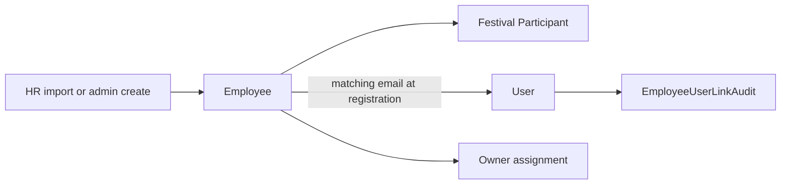
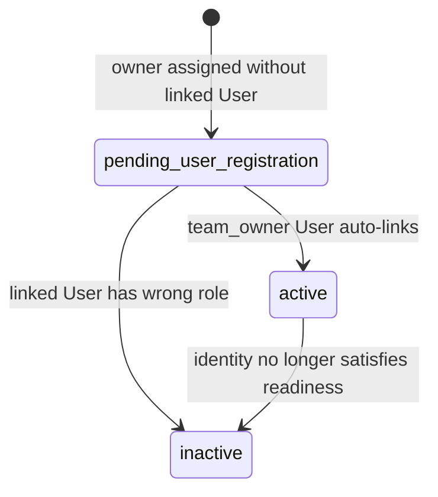
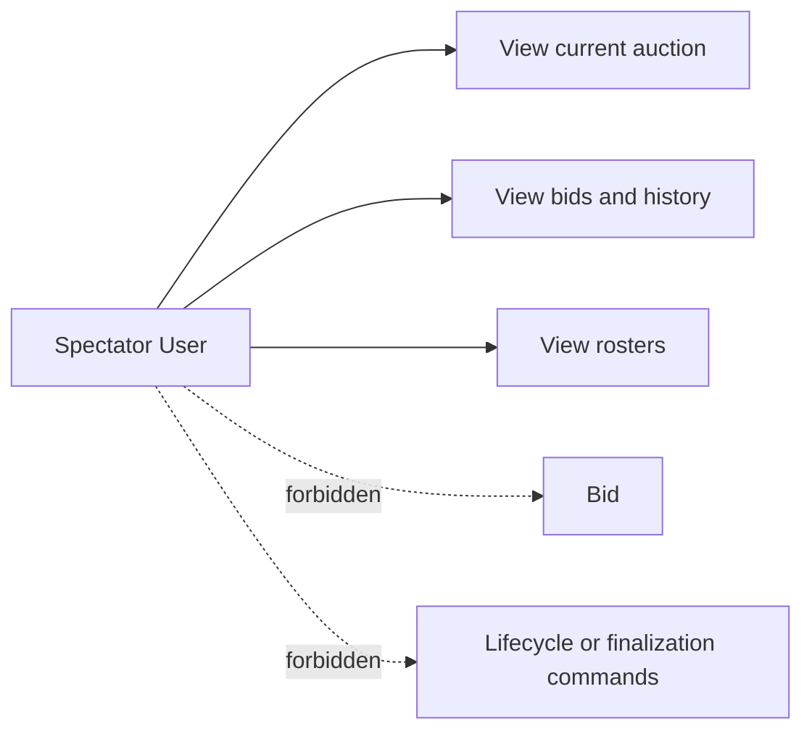
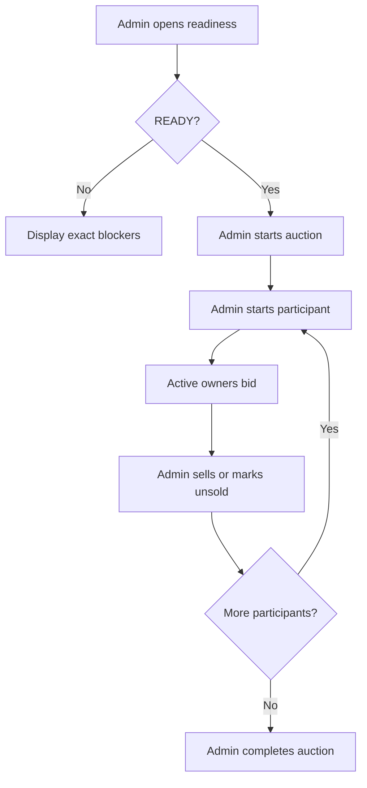
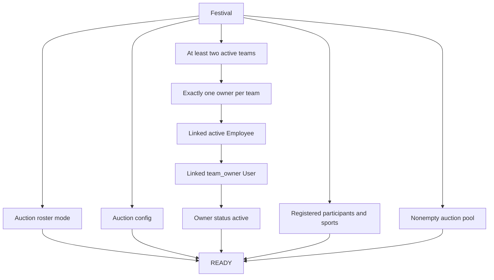

# Phase 3D Implemented Flow Audit

Audit date: 2026-06-10

Scope: Employee, User, Festival Participant, Owner, Spectator, and Main
Festival Auction. Sport Teams, Sport Auctions, scheduling, competition,
standings, and results are excluded.

## Findings Before Phase 3D

### Employee and User

- Registration did not search Employees or link matching identities.
- Employee emails were not unique, but duplicate-email ambiguity was not
  detected.
- Manual User linking could replace an Employee's existing link.
- User-to-Employee linking had no audit record.
- Registration was not transactional across User and legacy Team creation.

### Festival Participant and Owner

- Festival Participants correctly used Employee as canonical identity.
- Owners could be assigned without a User account, but no lifecycle status
  distinguished pending account registration from an active owner.
- Registering later did not activate an existing owner assignment.
- A linked spectator or admin account could bid through the assignment chain.

### Spectator and Auction Authorization

- Auction lifecycle, participant selection, sell, and unsold routes were
  admin-protected.
- Auction reads and authenticated Socket.IO room joins were available for
  viewing.
- Bid authorization lacked an explicit `team_owner` role requirement.

### Auction Readiness

- Start validation checked only active-team count, owner count, and pool size.
- It did not validate linked Employee/User identity or owner activation.
- Failures returned a generic message instead of per-team blockers.
- No consolidated readiness endpoint or dashboard existed.

## Implemented Phase 3D Flow

### Employee Flow

Registration normalizes email to lowercase and searches Employees
case-insensitively. Exactly one unlinked match is linked transactionally.
Zero matches, duplicate matches, existing Employee links, and existing User
links are recorded without overwriting identity.

### Owner Flow

Owner assignment remains valid roster and purse data without a login. Bidding
requires `status=active`, an active Employee, a linked User, global
`team_owner` role, and the Festival owner assignment.

### Spectator Flow

### Auction Flow

### Readiness Validation

## Remaining Gaps

- Duplicate Employee emails require admin review; no merge workflow exists.
- Owner removal, replacement, transfer, and invitation flows are not included.
- Festival visibility remains broad to authenticated users.
- Main Auction still has no timer, base price, increment, or unsold retry.
- Auction completion can still leave eligible participants unauctioned.
- Node/npm were unavailable in this environment, so tests and builds require
  execution in an environment with Node.js installed.
