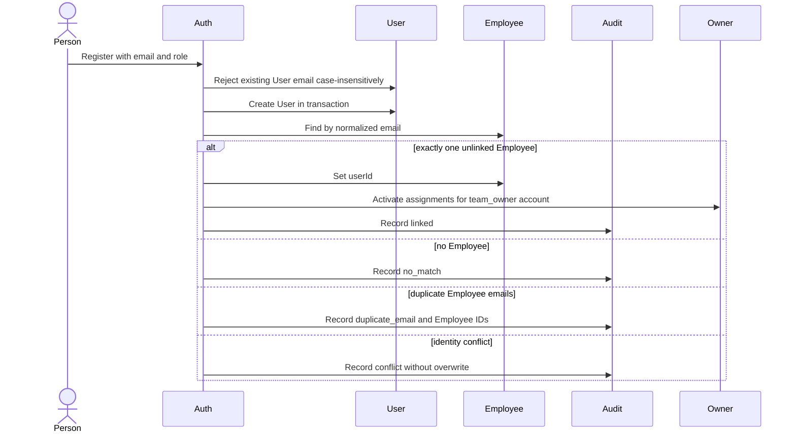
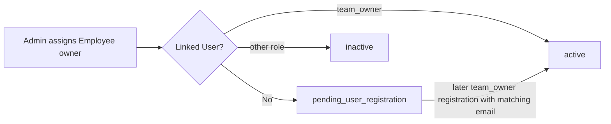

# Owner and User Linking Flow

Updated: 2026-06-10, Phase 3D

## Identity Model

```text
User (login identity)
  0..1
Employee (canonical corporate identity)
  1
FestivalParticipant
  0..1
FestivalTeamOwner
```

Employee remains canonical. Registration never creates an Employee and never
replaces an existing Employee link.

## Registration Auto-Linking



Outcomes returned as `employeeLinkStatus`:

- `linked`
- `no_match`
- `duplicate_email`
- `employee_already_linked`
- `user_already_linked`

## Existing Link Rules

- An Employee linked to another User is never overwritten.
- A User linked to another Employee is never moved.
- Re-registration with an existing User email is rejected before identity
  mutation.
- Manual admin linking uses the same conflict and audit rules.
- Duplicate Employee email matches require manual review.

## Owner Activation

`FestivalTeamOwners.status` values:

- `pending_user_registration`: no linked User.
- `active`: active Employee linked to a `team_owner` User.
- `inactive`: linked account has an incompatible role or identity is inactive.



No manual owner activation command is required. Successful registration-time
or admin linking updates existing owner assignments.

## Authorization

An accepted Festival bid requires:

```text
Authenticated User.role = team_owner
  -> Employee.userId
  -> active Employee
  -> registered FestivalParticipant
  -> FestivalTeamOwner.status = active
  -> assigned Festival Team
```

Spectators can view current state, bids, history, rosters, and authenticated
auction broadcasts. They cannot bid or call lifecycle/finalization routes.

Admins alone can start, pause, resume, complete, select participants, sell, or
mark unsold.

## Superseded Owner Registration Flow

The registration-dependent owner states above are retained only as historical
context for older data. New owner assignments use automatic provisioning:

1. Admin selects a Festival Participant backed by an Employee.
2. The server reuses the linked or email-matched User, or creates one.
3. The User is linked to the Employee and assigned `team_owner`.
4. Ownership is activated in the same database transaction.
5. Credentials and login/reset instructions are emailed automatically.
6. Auto-created users must change the temporary password before HTTP or
   Socket.IO application access.

Current readiness is: Employee exists, User exists, User role is
`team_owner`, and ownership status is `active`. Public Team Owner registration
is disabled.
