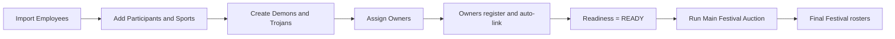

# Sports Festival Platform User Guide

## Phase 3G Admin Operations

The Festival Setup Wizard guides Details, Sports, Employees, Participants,
Teams, Owners, Retentions, Budget, Auction Pool, and Review & Launch. Progress
resumes from browser storage. The readiness dashboard shows READY/NOT READY,
exact blockers, operational counts, and Team Owner status.

After auction launch, setup sections are read-only. Unsold participants appear
under Unsold Players and may be selected individually or re-auctioned together.

## Phase 3F Main Auction Experience

- Admin selects a participant and enters the base price.
- Current bid begins at base price and the system displays the next valid bid.
- Owners click `PLACE BID`; they never enter an amount.
- Accepted bids reset the 20-second timer.
- Expiry locks bidding until admin extends, sells, or marks unsold.
- Pause preserves remaining time and Resume continues it.
- Team cards show Owner, remaining purse, purchases, retentions, and roster.
- Bid and completed auction histories include timestamps.

Spectators remain read-only. Server authorization remains authoritative.

Document date: 2026-06-10

This guide is the business and user-facing source of truth for the Sports
Festival platform. It explains the current working process, user
responsibilities, and planned future stages.

Status labels used throughout this guide:

- **Implemented**: available in the application today.
- **Partially Implemented**: a usable foundation exists, but important business
  capabilities are missing.
- **Planned**: approved direction, not available in the application today.

# 1. Purpose

## Why the Platform Exists

The platform helps an organization run a corporate sports festival from
employee onboarding through team allocation and live auctions.

It addresses these business problems:

- HR must process hundreds of employee sport selections efficiently.
- The same employee identity must be used throughout the festival.
- Festival franchises such as Demons and Trojans need controlled rosters.
- Team ownership must be based on festival assignment, not a permanent global
  job or application role.
- Owner costs, retentions, auction purchases, and remaining budgets must be
  visible.
- Owners and spectators need a live view of the Main Festival Auction.
- Future sport teams must be built from employees already owned by a Festival
  Team.

The platform is broader than an auction application. The Main Festival Auction
is one stage in the larger festival process.

## Festival, Festival Team, and Sport Team

### Festival

A Festival is the complete corporate event.

Example:

```text
ESPO 2026
  Sports: Chess, Cricket, Volleyball, Throwball
  Participants: registered employees
  Festival Teams: Demons, Trojans
  Main Festival Auction
  Future competitions and matches
```

### Festival Team

A Festival Team is a primary franchise for the whole Festival.

Examples:

- Demons
- Trojans

Every final Festival roster member belongs to one Festival Team. In the normal
Auction Mode workflow, employees join these rosters as owners, retained
participants, or Main Festival Auction purchases.

### Sport Team

A Sport Team is a future internal team created under one Festival Team for one
sport.

Examples:

- Demons Cricket Team A
- Demons Cricket Team B
- Trojans Throwball Team A

Sport Teams are not implemented today. They will use employees already present
in the parent Festival Team roster. They will not create duplicate employees or
new participant identities.

```text
Festival: ESPO 2026
  |
  +-- Festival Team: Demons
  |     +-- Future Sport Team: Cricket Team A
  |     +-- Future Sport Team: Cricket Team B
  |     +-- Future Sport Team: Volleyball Team A
  |
  +-- Festival Team: Trojans
        +-- Future Sport Team: Cricket Team A
        +-- Future Sport Team: Throwball Team A
```

# 2. User Types

## Admin

### Responsibilities

- Maintain the Employee Directory.
- Import employees from HR files.
- Create Festivals and enable sports.
- Add employees as Festival Participants.
- Record participant sport selections.
- Select Auction Mode or Manual Mode.
- Create Festival Teams.
- Configure budgets and owner cost in Auction Mode.
- Assign owners and create retentions.
- Run and finalize the Main Festival Auction.
- Use manual assignment or auto-balance when Manual Mode is intentionally
  selected.

### Permissions

Admins have full Sports Festival management access. Only admins can change
Festival setup, assign owners, create retentions, control auctions, sell
participants, or mark participants unsold.

### Screens

- Employee Directory
- Festivals
- Festival Workspace
- Festival Team Builder
- Auction Setup
- Main Festival Auction
- Live Auction view

## Owner

An Owner is an Employee assigned to own one Festival Team. Ownership is a
Festival assignment, not a separate person and not automatically granted by
the global `team_owner` account label.

### Responsibilities

- Represent the assigned Festival Team.
- Review the current participant and registered sports.
- Monitor the Team's remaining purse.
- Place valid bids during a live Main Festival Auction.

### Permissions

- View Festival auction information.
- View the current participant, bids, pool, and purse summary.
- Bid only for the Festival Team they are assigned to.

Owners cannot:

- Start, pause, resume, or complete the auction.
- Select the next participant.
- Sell or mark a participant unsold.
- Assign owners.
- Create retentions.
- Change budgets.

### Screens

- Login
- Festival Auction Directory
- Live Festival Auction

## Spectator

### Responsibilities

- Watch Festival Auction activity.
- Follow participants, bids, sales, and auction history.

### Permissions

Spectators have read-only Festival Auction access after authentication.

They cannot bid or perform any administrative action.

### Screens

- Login
- Festival Auction Directory
- Live Festival Auction

## Employee

An Employee is the canonical corporate identity used throughout the Festival.
An Employee does not require a login account.

### Responsibilities

- Provide HR registration information.
- Select the sports they intend to participate in.
- Participate only in selected sports.

### Permissions

An Employee linked to a login account can read their own sport registrations.
There is not yet a complete employee self-service Festival dashboard.

### Screens

- Login, when an account exists
- Limited own-registration access through the current authenticated flow

# 3. Complete Festival Lifecycle

## Normal Business Flow

```text
HR receives employee registrations
              |
              v
Admin imports Employees
              |
              v
Admin creates Festival
              |
              v
Admin enables Festival Sports
              |
              v
Employees become Festival Participants
              |
              v
Sport selections are recorded
              |
              v
Admin creates Festival Teams
       Demons / Trojans
              |
              v
Festival uses Auction Mode
              |
              v
Admin configures budget and owner cost
              |
              v
Owners assigned and automatically retained
              |
              v
Optional participant retentions
              |
              v
Remaining participants enter Main Festival Auction
              |
              v
Winning bids create Festival Team roster membership
              |
              v
Final Demons and Trojans rosters
              |
              v
PLANNED: Sport Teams, captains, sport retentions
              |
              v
PLANNED: Sport allocation auctions
```

## Roster Formation Modes

Every Festival has one roster formation mode.

### Auction Mode

This is the default and primary business workflow.

```text
Owners + Retentions + Main Festival Auction -> Final Festival Rosters
```

Manual assignment, auto-balance, and assignment locking are unavailable in
this mode.

### Manual Mode

This is an administrative alternative for Festivals that will not use the Main
Festival Auction.

```text
Manual Assignment / Auto-Balance -> Lock -> Final Festival Rosters
```

Owner assignment, retentions, auction configuration, and auction start are
unavailable in this mode.

The two modes cannot be mixed for new activity.

# 4. Employee Flow

## Adding Employees

Admins can:

- Create an Employee manually.
- Import many Employees through CSV.
- Import Employees together with Festival participation and sport selections.

Employee Number is the primary HR matching key. Name-only matching is not the
normal workflow.

Gender is a required Employee master attribute. Allowed values are Male and
Female. Festival Participants, Festival rosters, and future Sport Teams reuse
that Employee value instead of asking for gender again.

## Employee Directory CSV

```csv
EmployeeNumber,Name,Email,Department,Gender
EMP001,Vamsi Rao,vamsi@company.com,IT,Male
EMP002,Rahul Kumar,rahul@company.com,Finance,Male
EMP003,Priya Shah,priya@company.com,HR,Female
```

The import:

- Creates a new Employee when Employee Number is new.
- Updates the matching Employee when Employee Number already exists.
- Validates required fields and email format.
- Requires Gender and accepts Male/Female case-insensitively.
- Reports row-level errors.
- Continues importing valid rows when other rows fail.
- Does not create login accounts.

## Festival Employee and Sport CSV

The Festival Workspace supports a combined Festival import:

```csv
EmployeeNumber,Name,Email,Department,Chess,Badminton,Carrom,TableTennis,Cricket,Volleyball,Throwball
EMP001,Vamsi Rao,vamsi@company.com,IT,No,No,No,No,Yes,Yes,No
EMP002,Rahul Kumar,rahul@company.com,Finance,No,No,No,No,Yes,No,No
EMP003,Priya Shah,priya@company.com,HR,Yes,No,Yes,No,No,No,No
```

This import can:

1. Match an existing Employee by Employee Number.
2. Update non-gender directory details.
3. Add or reactivate the Employee as a Festival Participant.
4. Add sports marked `Yes`.
5. Remove sports marked `No`.
6. Continue after row-level errors.

`Yes` and `No` are case-insensitive. The file must be CSV; native Excel
`.xlsx` files are not currently accepted. Gender is intentionally omitted:
import Employees through the Employee Directory first so the canonical gender
is established once.

## User Account Linking

Employee identity and login identity are separate:

```text
Employee without login
  -> can be registered
  -> can select sports
  -> can join a roster
  -> can be retained or auctioned

Employee linked to User account
  -> can also log in
  -> can use authorized personal features
```

An Owner must be linked to a User account to log in and bid. Assigning an Owner
does not automatically create credentials. When the Owner later registers a
`team_owner` account with the same Employee email, the link and Owner
activation occur automatically. Duplicate Employee email matches require
admin review.

## Example

```text
Employee: Priya Shah
Employee Number: EMP003
Festival: ESPO 2026
Selected Sports: Chess, Carrom
Login Account: Not required
Festival Team: Assigned later through retention, auction, or Manual Mode
```

# 5. Festival Setup Flow

## Step 1: Create the Festival

The admin opens the Festivals screen and enters:

- Festival name
- Unique Festival code
- Start and end dates
- Registration dates, when known
- Timezone
- Currency

Example:

```text
Name: ESPO 2026
Code: ESPO-2026
Dates: August 10-20, 2026
Timezone: Asia/Kolkata
Currency: INR
```

New Festivals begin in draft status.

## Step 2: Enable Sports

The admin opens the Festival Workspace and enables the sports offered in that
Festival.

Possible sports include:

- Chess
- Badminton
- Carrom
- Table Tennis
- Cricket
- Volleyball
- Throwball

Only enabled sports can be selected for Festival Participants.

## Step 3: Add Participants

The admin can:

- Search and multi-select Employees.
- Select all loaded search results.
- Add all active Employees.
- Import the combined employee and sport CSV.
- Remove selected participants when business rules allow.

Adding an Employee to a Festival does not duplicate the Employee. It creates a
Festival-specific participation record.

## Step 4: Register Sports

Participants may select multiple sports. Selection is Yes/No only.

```text
Vamsi
  Cricket: Yes
  Volleyball: Yes
  Chess: No
```

No skill score, rating, experience level, or playing ability is recorded.

The number of selected sports is displayed for information and is used only by
the optional Manual Mode auto-balance tool.

# 6. Team Creation Flow

## Creating Festival Teams

Admins create the primary Festival franchises before roster formation.

Example:

```text
Festival: ESPO 2026

Festival Teams:
  Demons
  Trojans
```

Creating Demons and Trojans creates the destinations for roster allocation. It
does not automatically assign employees.

## Selecting the Roster Mode

For the approved auction-first workflow, keep the Festival in Auction Mode.

Use Manual Mode only when the Festival intentionally will not run a Main
Festival Auction.

## Budget

In Auction Mode, the admin configures:

- Total budget for each Festival Team.
- Common mandatory Owner cost.

Example:

```text
Team budget: 20,000,000
Owner cost:   2,000,000
```

The displayed Team purse is calculated as:

```text
Remaining purse =
  Total budget
  - Owner cost
  - Retention amounts
  - Successful auction purchase amounts
```

## Owner Assignment

The admin assigns an existing Festival Participant as Owner.

```text
Vamsi -> Owner of Demons
Rahul -> Owner of Trojans
```

Owner assignment:

- Does not create a new Employee.
- Does not create a separate participant.
- Adds the Owner to the same Festival Team roster.
- Deducts the mandatory Owner cost.
- Removes the Owner from the auction pool.

An Employee may own only one Festival Team in the same Festival.

## Retentions

Before the Main Festival Auction, the admin may retain a participant directly
into a Festival Team.

Example:

```text
Demons retains Priya for 500,000
```

The retention:

- Adds Priya to the Demons roster immediately.
- Deducts 500,000 from the Demons purse.
- Removes Priya from the auction pool.
- Prevents Priya from joining another Festival Team.

Retentions can be created or removed only before the Main Auction leaves setup.

# 7. Main Festival Auction Flow

## Example Setup

```text
Festival: ESPO 2026

Teams:
  Demons
  Trojans

Participants:
  Vamsi
  Rahul
  Priya

Budget per Team: 20,000,000
Owner cost:       2,000,000
```

## Step 1: Assign Owners

```text
Vamsi -> Demons Owner
Rahul -> Trojans Owner
```

Both Owners become roster members automatically.

```text
Demons remaining purse:  18,000,000
Trojans remaining purse: 18,000,000
```

Priya has not been retained or assigned, so Priya enters the auction pool.

## Step 2: Owners Log In

Vamsi and Rahul each need:

1. An application User account.
2. That User linked to the correct Employee.
3. An active Owner assignment for this Festival.

The system derives the bidding Team from this chain. Owners do not submit or
choose a Team identity when bidding.

## Step 3: Admin Starts the Auction

Before starting, the system requires:

- Auction Mode.
- At least two active Festival Teams.
- Every active Team has an Owner.
- Auction budget configuration exists.
- At least one eligible participant is in the pool.

The admin starts the Main Festival Auction and manually selects Priya as the
current participant.

Owners and spectators see:

- Employee Number
- Employee name
- Gender
- Department
- Selected sports
- Number of selected sports
- Current highest bid
- Leading Team
- Remaining purse per Team
- Bid history

## Step 4: Owners Bid

```text
Demons bid:  500,000
Trojans bid: 700,000
```

Each bid must:

- Be placed while the auction is live.
- Be higher than the current bid.
- Be within the bidding Team's remaining purse.
- Come from the authenticated assigned Owner.

## Step 5: Admin Finalizes the Sale

The admin selects Sell.

```text
Winner: Trojans
Participant: Priya
Winning bid: 700,000
```

The result is:

```text
Trojans roster:
  Rahul - Owner
  Priya  - Auction purchase

Trojans budget:
  Opening budget:  20,000,000
  Owner cost:      -2,000,000
  Priya purchase:    -700,000
  Remaining purse: 17,300,000
```

Priya cannot be sold again because Priya now belongs to Trojans.

## Pause, Resume, Unsold, and Completion

The admin may:

- Pause a live auction.
- Resume a paused auction.
- Mark the current participant unsold.
- Complete the overall auction when no participant is active.

An unsold participant does not join a Festival Team and cannot currently be
returned for another auction round.

# 8. Owner Flow

## Owner Login

An Owner logs in through the normal Login screen.

Ownership works only when:

```text
Login User
  -> linked Employee
  -> registered Festival Participant
  -> assigned Festival Team Owner
```

The global `team_owner` account label alone does not grant Festival ownership.

## Owner Permissions

The Owner can:

- Open the Festival Auction Directory.
- Enter the live Festival Auction.
- View participant details and selected sports.
- View bids and remaining purses.
- Place bids for the assigned Festival Team.

## Owner Dashboard

The current owner experience is the Live Festival Auction page. It provides:

- Auction status
- Current participant
- Current bid and leading Team
- Remaining Team purse
- Auction pool
- Bid history
- Place Bid control when authorized

There is not yet a complete Festival Team management dashboard for Owners.

## Owner Restrictions

Owners cannot:

- Assign themselves or another Owner.
- Change Team budgets or Owner cost.
- Create or delete retentions.
- Select the current participant.
- Start, pause, resume, or complete the auction.
- Sell or mark a participant unsold.
- Bid for another Team.
- Bid without a linked login account.

# 9. Spectator Flow

Spectators must log in.

They can:

- Open the Festival Auction Directory.
- Enter a Festival's Live Auction page.
- Watch live status changes.
- View the current participant and selected sports.
- View current bids, leading Team, purse summaries, pool, and history.
- Receive real-time auction updates.

They cannot:

- Place bids.
- Change Festival setup.
- Assign Owners.
- Create retentions.
- Control or finalize the auction.

Current visibility is broad: any authenticated User can view any available
Festival Auction. Festival-specific invitations or private spectator access
are not implemented.

# 10. Final Festival Roster

The Festival roster is the authoritative list of employees belonging to a
Festival Team.

In Auction Mode, roster membership is created from:

```text
Owner assignment
  + Pre-auction retention
  + Successful Main Festival Auction sale
  = Final Festival Team roster
```

Example:

```text
ESPO 2026

Demons
  Vamsi - Owner
  Arjun - Retained
  Neha  - Auction purchase

Trojans
  Rahul - Owner
  Priya - Auction purchase
  Kiran - Auction purchase
```

A participant can belong to only one Festival Team in the same Festival.

The auction result affects both roster and purse:

```text
Sold to Team
  -> participant joins Team roster
  -> winning amount counts as Team spending
  -> participant leaves auction eligibility
```

The application currently does not provide a separate formal "final roster
approved" action. Auction completion and the recorded memberships represent
the practical roster outcome.

# 11. Future Sport Team Flow

**Status: Planned. This section does not describe implemented functionality.**

After Festival rosters are final, each Festival Team will organize eligible
members into sport-specific teams.

```text
Final Festival roster
        |
        +-- employees registered for Cricket
        |       -> Cricket sport pool
        |
        +-- employees registered for Volleyball
        |       -> Volleyball sport pool
        |
        +-- employees registered for Throwball
                -> Throwball sport pool
```

Example target structure:

```text
Demons
  Cricket Team A
  Cricket Team B
  Volleyball Team A

Trojans
  Cricket Team A
  Throwball Team A
```

Planned eligibility rule:

```text
Employee belongs to Demons
AND Employee selected Cricket
AND Employee gender matches the event category, unless the event is Mixed
THEN Employee may enter a Demons Cricket allocation process
```

Future Men, Women, and Mixed event filters will read `Employee.gender`. They
must not add a second gender field to FestivalParticipant or Sport Team
membership records.

An Employee owned by Trojans cannot be placed into a Demons Sport Team.

The same Employee may participate in different sports:

```text
Employee A
  Demons Cricket Team A
  Demons Volleyball Team B
```

This uses the same Employee and Festival Participant. No duplicate player or
participant record will be created.

Planned sport-level capabilities include:

- Sport Teams
- Sport Team memberships
- Captains
- Sport retentions
- Sport allocation budgets or credits
- Sport allocation auctions

Sport auctions are planned as allocation-credit auctions, not another
financial purchase of the Employee. The Festival Team already acquired the
Employee financially during the Main Festival Auction.

# 12. Current Implementation Status

| Feature | Status | Current position |
|---|---|---|
| Employee Directory | Implemented | Manual creation, search, update, CSV import |
| Employee login independence | Implemented | Employees can exist without User accounts |
| Employee/User linking | Implemented | Registration auto-links one case-insensitive Employee email match; admin fallback remains |
| Festival creation | Implemented | Draft Festival creation and reads |
| Festival lifecycle transitions | Not Implemented | No normal status transition UI/API |
| Festival sport setup | Partially Implemented | Sports can be enabled; update/removal lifecycle is missing |
| Festival Participants | Implemented | Single, bulk, add-all, import, withdrawal/reactivation |
| Sport selection | Implemented | Multiple Yes/No selections, no skill ratings |
| Employee and sport CSV import | Implemented | Employee Number matching and partial success |
| Festival Team creation | Implemented | Demons/Trojans-style franchise setup |
| Roster Formation Mode | Implemented | Auction Mode or Manual Mode |
| Manual assignment | Implemented | Manual Mode only |
| Auto-balance | Implemented | Manual Mode only; selected-sport count used |
| Manual roster lock | Implemented | Manual Mode only; no unlock |
| Main Auction budget setup | Implemented | Team budget and Owner cost |
| Owner assignment | Implemented | Auction Mode; Owner joins roster and consumes cost |
| Owner account onboarding | Implemented | Pending owners activate after matching `team_owner` registration |
| Festival readiness | Implemented | Admin counts, Team blockers, and READY/NOT READY validation |
| Main retentions | Implemented | Pre-auction roster and purse effect |
| Main Auction pool | Implemented | Excludes rostered and previously auctioned participants |
| Main Festival Live Auction | Implemented | Lifecycle, participant selection, bidding, sale, unsold |
| Real-time auction viewing | Implemented | Authenticated live updates |
| Final Festival roster | Partially Implemented | Memberships are authoritative; no separate approval/finalization screen |
| Unsold retry | Implemented | Selected or all unsold participants may return to Available |
| Owner replacement/removal | Not Implemented | Assignment is not transferable through the UI |
| Sport Teams | Not Implemented | Planned after final Festival rosters |
| Sport captains | Not Implemented | Planned |
| Sport retentions | Not Implemented | Planned |
| Sport Auctions | Not Implemented | Planned allocation-credit workflow |
| Competition formats | Not Implemented | Planned |
| Scheduling and matches | Not Implemented | Planned |
| Scoring, results, standings | Not Implemented | Planned |

# 13. Known Limitations

## Ownership Onboarding

- Assigning an Owner does not create a login account.
- Matching `team_owner` registration auto-links and activates the Owner.
- Duplicate Employee emails or identity conflicts require admin review.
- Manual fallback linking still requires a raw User ID.
- The global `team_owner` label is separate from Festival ownership.
- Spectator and admin accounts cannot bid even when linked to an Owner
  Employee.
- Owner replacement, removal, and transfer are not implemented.

## Roster Workflow

- The earlier manual-versus-auction conflict is resolved by Roster Formation
  Mode.
- Auction Mode and Manual Mode cannot be used together for new activity.
- Existing Festivals default to Auction Mode, even if historical manual
  memberships already exist.
- Manual roster locking cannot be reversed.
- There is no separate final-roster approval action.
- Participant withdrawal is restricted once ownership or retention exists.

## Main Auction

- Admin enters a participant base price before starting the round.
- The shared Tournament increment engine calculates every next bid.
- Each round uses a persisted 20-second countdown.
- Owners submit no amount; the server accepts only the calculated next bid.
- Sale and unsold decisions are controlled by the admin after timer expiry.
- An unsold participant cannot currently return for a later round.
- The auction may be completed while unauctioned pool participants remain, as
  long as no participant is currently active.
- Budget is calculated from Owner cost, retentions, and sales; there is no
  immutable financial transaction ledger.
- Real-time multi-server scaling is not yet supported.

## Employee and Festival Administration

- CSV imports are synchronous.
- Native `.xlsx` import is not supported.
- Employee self-service registration is limited.
- Registration dates are stored but not automatically enforced.
- Festival lifecycle transitions are not implemented.
- Authenticated Festival Auction visibility is not organization-private.

## Future Sport-Team Work

The following must be built before Sport Auctions can begin:

- Sport Team identity and management
- Sport eligibility based on final Festival roster and sport selection
- Sport Team membership
- Captain assignment
- Sport retentions
- Allocation-credit rules and balances
- Sport Auction readiness checks
- Competition entries and scheduling

# 14. Glossary

## Festival

The complete corporate sports event containing sports, employees, Festival
Teams, roster formation, auctions, and future competitions.

## Festival Participant

An Employee registered for one specific Festival. It is not a duplicate
Employee identity.

## Employee

The canonical corporate person record. An Employee can exist and participate
without an application login.

## Festival Team

A primary Festival franchise, such as Demons or Trojans. A participant may
belong to only one Festival Team in a Festival.

## Owner

An existing Employee and Festival Participant assigned to represent one
Festival Team. Ownership grants scoped bidding rights after the Employee is
linked to a login account.

## Retention

A pre-auction allocation that places a participant directly into a Festival
Team and deducts a configured amount from that Team's purse.

Owner assignment includes a mandatory Owner-cost retention effect.

## Auction Pool

The registered Festival Participants still eligible for the Main Festival
Auction. Owners, retained participants, roster members, and sold participants
are excluded. Unsold participants are excluded until an admin re-auctions
them; prior auction rounds do not by themselves prevent another attempt.

## Festival Roster

The authoritative list of Festival Participants belonging to a Festival Team.
In Auction Mode, it is formed through Owners, retentions, and successful Main
Festival Auction sales.

## Sport Team

A planned internal team for one sport under a Festival Team, such as Demons
Cricket Team A. It must use employees from the parent Festival roster.

## Captain

A planned sport-level assignment for an eligible member of a Sport Team.
Captain functionality is not implemented.

## Sport Auction

A planned second-level allocation process inside one Festival Team and one
sport. It will allocate already-owned, sport-eligible employees into internal
Sport Teams using non-financial allocation credits.
# Phase 3D Stabilization

Before starting the Main Festival Auction, open the **Festival Readiness**
section in the Festival Workspace.

The dashboard shows:

- Employees
- Participants
- Sports Registered
- Teams Created
- Owners Assigned
- Owners Activated
- Retentions
- Auction Pool Size

The overall status is `READY` or `NOT READY`. Each Team displays its exact
owner blocker, such as `Owner account missing`.

Owners assigned before account creation show
`pending_user_registration`. When the person registers a `team_owner` account
using the Employee email, the Employee link and owner activation occur
automatically. Duplicate Employee emails are not auto-linked and require admin
review.

Spectators remain read-only. Only active Festival owners using a `team_owner`
account can bid. Only admins can control or finalize the auction.


# Phase 3G.1 Festival Workspace

Festival admins complete configuration through a nine-step wizard that
displays one step at a time and resumes from the last browser-saved step.

The admin workspace provides two modes:

- Operations View
- Edit Festival Configuration

Operations is the default after launch. Configuration remains accessible, but
locked controls stay disabled and backend validation remains authoritative.

Owners use Overview, Teams, Auction, and Bid History tabs. Spectators use
Overview, Live Auction, Teams, Results, and History tabs.

Admins use dedicated Teams, Bid History, Results, and Audit tabs. Select a
Team to view its Owner, remaining purse, retentions, purchased players, and
current roster.

Bid History lists auctioned participants. Select **View Bids** to see base
price, sold price, sold Team, the full bid sequence, and timestamps. Owners can
filter Bid History by My Bid Activity, Won Participants, and Outbid
Participants.

This is a navigation and usability change only. Sport Teams, captains, Sport
Auctions, scheduling, competition formats, standings, and results remain
unimplemented.

# Correcting Configuration After Auction Start

Admins can open **Edit Festival Configuration** after auction start.

1. Review the **Configuration Status** card.
2. Select **Unlock Configuration**.
3. Type `UNLOCK` and confirm.
4. Correct Festival details, Participants, Teams, Owners, Retentions, or
   available Auction Pool membership.
5. Return to the status card and select **Relock Configuration**.
6. Type `RELOCK` and confirm.

Every unlock, relock, Owner change, participant add/remove, Team update,
retention update, and budget update is audited.

Unlock does not permit editing bids, results, sold assignments, or winning
amounts. Budget remains read-only after a sold result exists. The current
auction participant cannot be removed, retained, or made an Owner.
